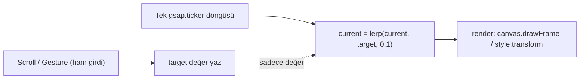

# Favori Kozmetik — Tam İyileştirme Planı (Güvenlik + Veri + SEO + Animasyon)

Bu plan iki kaynağı birleştirir: `analizz.md` mimari denetimi (BULGU 1-10 + Bölüm 3) ve frontend animasyon/akıcılık yol haritası. Fazlar risk/aciliyet + kullanıcının mevcut odağına (frontend) göre sıralandı. Her faz bağımsız uygulanabilir ve tek tek "kodla" komutuyla ilerlenebilir.

## Kararlar (onaylandı)
- Hero: mevcut kare-dizisi canvas motorunu ([src/hooks/useSpriteScroll.ts](src/hooks/useSpriteScroll.ts)) yerinde optimize et. Verim yetersizse plan içindeki opsiyonel video-scrub (all-keyframe MP4) yoluna geçilir.
- Lenis: birincil olarak her yerde (mobil dahil) + tek `gsap.ticker` saatinden sürülür. Mobilde FPS düşerse masaüstü-only fallback'e geçilir. `prefers-reduced-motion`'da her zaman kapalı.

---

## FAZ 0 — Kritik Güvenlik (ACİL, koddan önce her şeyin üstünde)

### 0A. `/api/upload` yetkilendirme + dosya doğrulama (BULGU-1)
- [src/app/api/upload/route.ts](src/app/api/upload/route.ts): `createSupabaseAdmin()` (service_role) çağrısından ÖNCE `createSupabaseServer().auth.getUser()` + `profiles.role === 'admin'` kontrolü ekle.
- Dosya tipi whitelist (`png/jpg/jpeg/webp/avif`), `MAX_BYTES` (5MB) sınırı, `folder` parametresini sabit whitelist'e (`products`/`banners`) kilitle. SVG'yi reddet (stored-XSS).

### 0B. Admin auth mimarisini tutarlı hale getir (BULGU-2)
- [middleware.ts](middleware.ts): `adminAuthV2` çerez varlık kontrolünü kaldır; `@supabase/ssr` `createServerClient` + `getUser()` ile gerçek oturuma bağla. `matcher: ['/admin/:path*']`.
- [src/app/api/products/route.ts](src/app/api/products/route.ts): `isAdminRequest` içindeki doğrulanmamış `adminAuthV2` desenini kaldır; yalnızca `getUser()+role`'e güven.
- [src/app/admin/middleware.ts](src/app/admin/middleware.ts): deprecated stub — sil.

---

## FAZ 1 — Frontend Animasyon & Performans (ana odak)

Ortak ilkeler (tüm alt-adımlara uygulanır): yalnızca `transform`/`opacity` animasyonu; `translate3d` + animasyon süresince `will-change` (idle'da kaldır); tek saat = `gsap.ticker`; girdi→render ayrımı + `lerp`.

### 1A. Hero — tek-ticker lerp + matchMedia + mobil sadeleştirme
- [src/lib/animation/scrollConfig.ts](src/lib/animation/scrollConfig.ts) + [src/hooks/useSpriteScroll.ts](src/hooks/useSpriteScroll.ts):
  - `gsap.matchMedia()` ile desktop/mobil dallandır (ayrı `scrollDistanceVh`, `scrub`, autoplay aç/kapa).
  - Çift yumuşatma katmanını sadeleştir: ScrollTrigger `onUpdate` yalnızca `targetFrame = progress * lastFrame` yazsın; tek `gsap.ticker` döngüsü `current`'ı lerp'leyip `renderer.drawFrame(index)` çağırsın (mevcut `scrub: 0.5` + ayrı `scheduleDraw` rAF birleşir).
  - Scroll-hijack autoplay'i (satır 177-272, `gsap.to(window,{scrollTo})`) mobilde kapat; desktop'ta opsiyonel bırak veya Lenis'e devret.
  - `dvh` resize jank'i: `onResize`'da yalnızca `innerWidth` değişince `ScrollTrigger.refresh()` (yükseklik-only/adres-çubuğu değişimini yok say).
- [src/lib/renderer/types.ts](src/lib/renderer/types.ts) (`BaseCanvasRenderer`): canvas context'i `{ alpha: false, desynchronized: true }` ile aç; opak sahnede `clearRect`'i kaldır (drawImage cover zaten örtüyor).
- [src/components/sections/HeroSection.tsx](src/components/sections/HeroSection.tsx): `willChange`'i pinlenen sarmalayıcıya taşı (canvas'a değil).
- Opsiyonel fallback (verim yetmezse): all-keyframe MP4 + tek `<video>` scrub (PROMPT.txt kuralları a/b/c) + `SpriteSheetRenderer` atlas.

### 1B. Marquee — ref tabanlı sıfır-render (BULGU-3 + a11y)
- [src/components/home-products-bryhel.tsx](src/components/home-products-bryhel.tsx):
  - `translateX` state'ini `useRef`'e taşı; animasyonda sıfır React render.
  - Ofseti tek `gsap.ticker`/rAF döngüsünde `innerRef.current.style.transform = translate3d(${offset}px,0,0)` ile yaz.
  - Drag'i de ref üzerinden yürüt (pointermove'da `setState` yok).
  - `IntersectionObserver` (offscreen) + `document.hidden` pause.
  - `prefers-reduced-motion`: marquee dur, kullanıcı elle kaydırsın; `role="region"` + `aria-label` ekle (BULGU-10).
- [src/styles/home-products-bryhel.css](src/styles/home-products-bryhel.css): `.carousel__inner`'a animasyonda `will-change: transform` + `backface-visibility: hidden`.

### 1C. Lenis smooth-scroll (tek saat)
- Yeni `SmoothScroll` provider + [src/app/layout.tsx](src/app/layout.tsx)'e sar. `npm i lenis`.
- `gsap.ticker.add((t)=>lenis.raf(t*1000))` + `gsap.ticker.lagSmoothing(0)`; ikinci rAF açma. `lenis.on('scroll', ScrollTrigger.update)`. `window.__lenis` expose.
- Birincil: mobil dahil aktif; mobil-uyumlu ayarlar. Fallback bayrağı: mobilde/düşük güçlü cihazda kapatma. `prefers-reduced-motion`'da tamamen atla.
- Faz 1A/1B döngülerini de aynı ticker'a bağla (tek saat).

### 1D. Kart hover + global CSS mikro-optimizasyon
- [src/components/product-card-modern.tsx](src/components/product-card-modern.tsx): `transition-all` → `transition-transform`/`transition-opacity`; `hover:shadow-2xl`'i opacity'li pseudo-element gölgeye çevir. Mount `animate-fade-in-up`'ı yalnızca ilk görünürde tetikle.
- [src/app/globals.css](src/app/globals.css): global `@media (prefers-reduced-motion: reduce)` sıfırlaması; ağır offscreen section'lara `content-visibility: auto`.

---

## FAZ 2 — Veri Bütünlüğü & Caching

### 2A. Tek kaynak, sunucuda çöz (BULGU-4)
- Yeni `src/lib/home-data.ts`: `getHomeSections()` ile `home_carousel_products`, `own_production_products`, fallback `products`'ı `Promise.all` ile sunucuda çek.
- [src/app/page.tsx](src/app/page.tsx): carousel'lere hazır veri ver.
- İstemci `no-store` fetch'lerini kaldır: [src/components/products-carousel.tsx](src/components/products-carousel.tsx), [src/components/home-products-bryhel.tsx](src/components/home-products-bryhel.tsx), [src/components/promo-banner-carousel.tsx](src/components/promo-banner-carousel.tsx). Flicker + fazladan istek biter.

### 2B. Deterministik sıralama (BULGU-5)
- [src/app/page.tsx](src/app/page.tsx) ve diğer listeleme sorgularına `.order('created_at',{ascending:false}).order('id',{ascending:true})` ekle. Client `Array.sort` yalnızca kullanıcı dropdown'ında kalsın.

### 2C. Caching stratejisi: force-dynamic → ISR + tag (Bölüm 3.1)
- [src/app/page.tsx](src/app/page.tsx): `force-dynamic` + `revalidate=10` çelişkisini gider. Cache'lenebilir okumalar için `cookies()` okumayan anon Supabase client veya `unstable_cache({tags:['products'],revalidate:60})`.
- Yazma yolları (`/api/products/[id]` PUT/DELETE, POST): `revalidateTag('products')`. `urun/[slug]` ve `kategori/*` için ISR `revalidate`.

---

## FAZ 3 — SEO & Server Components (Bölüm 3.2 / 3.3)

### 3A. `urun/[slug]` gövdesini SSR'a taşı
- [src/app/urun/[slug]/page.tsx](src/app/urun/[slug]/page.tsx): `'use client'` gövdeyi Server Component'e çevir; veriyi sunucuda çek (`getProductBySlug` mantığını paylaş). Etkileşimli parçaları (Sepete Ekle, Favori, galeri, adet) client "island"lara ayır. h1/fiyat/görsel ilk HTML'de.
- Ara adım: [src/app/urun/[slug]/layout.tsx](src/app/urun/[slug]/layout.tsx)'e `sr-only` ürün özeti (ad/marka/fiyat/açıklama) ekle.

### 3B. `kategori/*` gövdesini SSR'a taşı
- [src/app/kategori/[category]/page.tsx](src/app/kategori/[category]/page.tsx): aynı island deseni; ilk ürün listesi SSR'da.

---

## FAZ 4 — Kod Kalitesi, Temizlik & A11y

### 4A. Fiyat mantığını merkezileştir (BULGU-7)
- Yeni `src/lib/price.ts`: `dbToDisplay`/`displayToDb`/`toDisplayPrice`/`formatTRY`. `(price/100)/10`, `*1000`, `*10`/`/10` ve `.toLocaleString(...)` tekrarlarını (10+ dosya) buna migrate et. No-op [src/lib/format-price.ts](src/lib/format-price.ts)'i kaldır/yönlendir.

### 4B. Ölü & çift kod temizliği (BULGU-6, BULGU-8)
- Sil (hiçbir sayfa import etmiyor — doğrulandı): [src/components/scroll-hero.tsx](src/components/scroll-hero.tsx), [src/components/adaptive-scroll-hero.tsx](src/components/adaptive-scroll-hero.tsx), [src/components/deferred-adaptive-scroll-hero.tsx](src/components/deferred-adaptive-scroll-hero.tsx), eski slider [src/components/hero-section.tsx](src/components/hero-section.tsx).
- [src/lib/renderer/SpriteSheetRenderer.ts](src/lib/renderer/SpriteSheetRenderer.ts): 1A video/atlas fallback'i seçilmezse sil; seçilirse koru.
- Ürün kartı varyasyonlarını tek `ProductCard` + `variant` prop'unda birleştir (grid/list/compact).

### 4C. Service-role daraltma + log gürültüsü (BULGU-9)
- [src/lib/categories-server.ts](src/lib/categories-server.ts): `getPublicCategories()` service-role yerine anon client (RLS `categories_public_read` zaten açık).
- [src/app/api/coupons/validate/route.ts](src/app/api/coupons/validate/route.ts): rate-limit + input doğrulama.
- `console.log/error` gürültüsünü `NODE_ENV!=='production'` guard'ı/logger ile temizle (özellikle upload'daki yol sızdıran loglar).

### 4D. Erişilebilirlik (BULGU-10)
- [src/app/admin/layout.tsx](src/app/admin/layout.tsx): masaüstü "Çıkış Yap" butonuna eksik `onClick`'i ekle (fonksiyonel bug).
- Rating yıldızlarına `aria-label="5 üzerinden {rating}"`; marquee `role`/`aria-label` (1B'de). Reduced-motion global (1D'de).

---

## Önerilen Uygulama Sırası
1. Faz 0 (güvenlik — hemen).
2. Faz 1 (animasyon — kullanıcı odağı; en yüksek görünür kazanç: 1B marquee, sonra 1A hero, 1C Lenis, 1D).
3. Faz 2 (veri/caching — flicker + performans).
4. Faz 4A/4B (fiyat modülü + ölü kod — refactor borcu).
5. Faz 3 (SEO server components).
6. Faz 4C/4D (service-role, loglar, a11y kalanı).